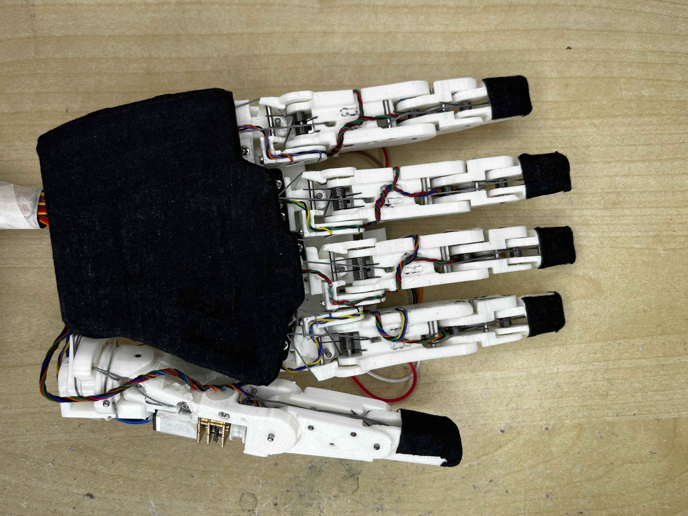

This Fully Actuated Life-like Compact OpeN-source (FALCON) hand was designed for research and bridges the gap between complex systems and expensive robots. It’s finger includes an underactuated mechanism, which grants it an enveloping behaviour, ideal when grasping objects. With it’s full actuation, the hand can perform complex movements, easily controlled with the associated library. The FALCON hand is accessible to all, with public project files and detailed documentation, thanks to which anyone can replicate or adapt the hand to easily fulfil their needs.

The FALCON Hand is intrinsically actuated and integrates itself well with other robotic entities. It has 20 degrees of freedom and presents comparable grasping capabilities to a human. You can find some videos demonstrating the FALCON hand's motion in the folder Videos.

## Buildling the FALCON Hand
Download this repo and you will find all the necessary files to 3D print the hand pieces in the folder 3DFiles. In the BuildingIntructions folder, open the index.html file in your prefered browser and you will have access to all the information you will need to build the hand.

If you have any questions or would like to share your version of the hand, feel free to contact me at clemence.sulmont@gmail.com!

## License

This project is licensed under the terms of the [Creative Commons Attribution-NonCommercial-ShareAlike 4.0 International](https://creativecommons.org/licenses/by-nc-sa/4.0/) license.

You are free to:
- **Share** — copy and redistribute the material in any medium or format
- **Adapt** — remix, transform, and build upon the material

Under the following terms:
- **Attribution** — You must give appropriate credit, provide a link to the license, and indicate if changes were made. You may do so in any reasonable manner, but not in any way that suggests the licensor endorses you or your use.
- **NonCommercial** — You may not use the material for commercial purposes.
- **ShareAlike** — If you remix, transform, or build upon the material, you must distribute your contributions under the same license as the original.
